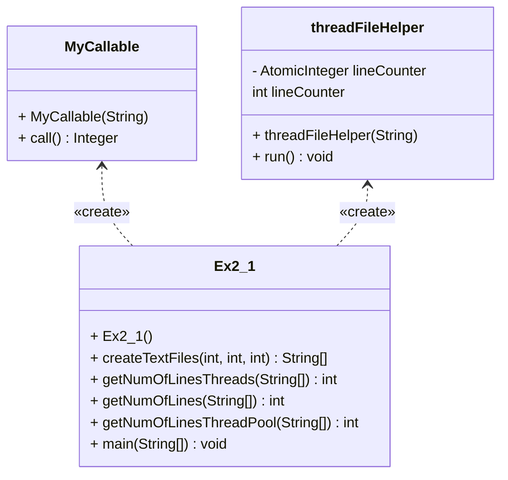

# Multi-Threading File Line Counter

This program demonstrates the use of multi-threading in Java to count the number of lines in a large number of text files. It includes three methods for counting the lines, each with a different approach for handling the threads.

## Methods

- `createTextFiles(int n, int seed, int bound)`: A helper method that creates n text files with random number of lines between 0 and bound.

- `getNumOfLines(String[] fileNames)`: A method that reads all files sequentially and counts the number of lines, uses a single thread, and returns the total number of lines.

- `getNumOfLinesThreads(String[] fileNames)`: A method that uses multiple threads to read the files and count the number of lines in each file concurrently and returns the total number of lines. each threadFileHelper object is now extend Thread class and using atomic integer for counting

- `getNumOfLinesThreadPool(String[] fileNames)`: A method that uses a fixed thread pool to read the files and count the number of lines in each file concurrently and returns the total number of lines.

## Usage

For `getNumOfLines(String[] fileNames)`= that uses a single thread, it takes longer time to count the lines in all files, it is slower than the other two methods since it is not utilizing the power of multi-threading, and since the program is waiting for each file to be read sequentially and counted before it proceeds to the next file.

For `getNumOfLinesThreads(String[] fileNames)` and `getNumOfLinesThreadPool(String[] fileNames)` both of them are using multi-threading to count the lines, but they have different way of handling threads, and it may lead to different performance.

`getNumOfLinesThreads(String[] fileNames)` creates a thread for each file that is being read, which can consume more resources, but it also enables the program to handle each file independently.

`getNumOfLinesThreadPool(String[] fileNames)` uses a fixed thread pool that creates a set number of threads, this allows for more efficient use of resources, since threads can be reused for multiple tasks, but it may also limit the program's ability to handle each file independently, since the threads in the pool are shared among all files.

