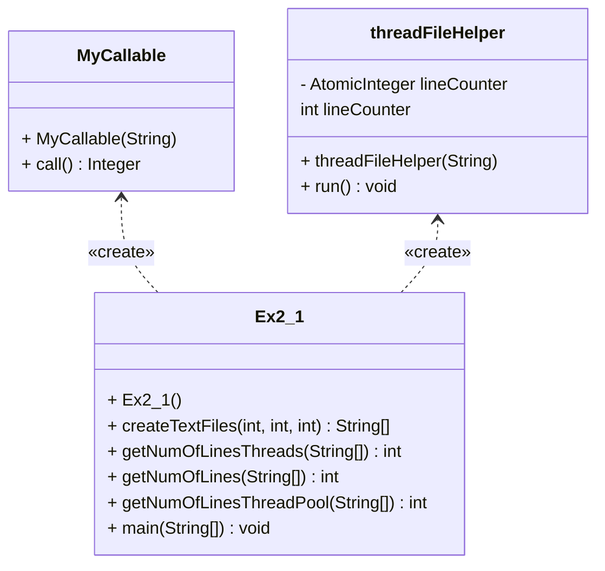

# Part1  LineCounting

This program demonstrates the use of multi-threading in Java to count the number of lines in a large number of text files.
It includes three methods for counting the lines, each with a different approach for handling the threads.
- getNumOfLines(String[] fileNames)
- getNumOfLinesThreads(String[] fileNames)
- getNumOfLinesThreadPool(String[] fileNames)

## Table of Contents-Part1
- [Methods](#Methods)
- [Class dependencies](#Class dependencies)
- [Comparing Each Approach](#Comparing Each Approach)

## Methods

- `createTextFiles(int n, int seed, int bound)`: A helper method that creates 'n' text files with random number of lines between 0 and bound.

- `getNumOfLines(String[] fileNames)`: A method that reads all files iteratively and counts the number of lines, uses a single thread, and returns the total number of lines.

- `getNumOfLinesThreads(String[] fileNames)`: A method that uses multiple threads to read the files and count the number of lines in each file concurrently and returns the total number of lines after all the threads are done. 

- `getNumOfLinesThreadPool(String[] fileNames)`: A method that uses a fixed(number of txt files) thread pool to read the files and count the number of lines in each file concurrently and returns the total number of lines.
like in the Threads method, each thread will read a file and after all the threads are done it will be added to the "SumOfLine" variable.

## Class dependencies

## Comparing Each Approach
we ran this program 4 times with different amount of files and line in each run, we wanted to see how much of a difference the amount of files / the amount of lines in the file
will affect the time elapsed and see how every approach managed to do.
- In the first run, we created 500 files, each containing a random number of lines between 0 and a maximum of 2500 lines:
 
| Method | Runtime(ms) | Sum of Lines |
  | -------- | -------- | -------- |
  | getNumOfLines  | 2759  | 638603  |
  | getNumOfLinesThreads  | 114  | 638603  |
  | getNumOfLinesThreadPool  | 107  | 638603  |

- In the second run, we created 500 files, each containing a random number of lines between 0 and a maximum of 75000 lines.

| Method | Runtime(ms) | Sum of Lines |
  | -------- | -------- | -------- |
| getNumOfLines  | 3346  | 18186103  |
| getNumOfLinesThreads  | 477  | 18186103  |
| getNumOfLinesThreadPool  | 514  | 18186103  |

- In the third run, we created 3000 files, each containing a random number of lines between 0 and a maximum of 2500 lines.

| Method | Runtime(ms) | Sum of Lines |
  | -------- | -------- | -------- |
| getNumOfLines  | 11492  | 3685966  |
| getNumOfLinesThreads  | 479  | 3685966  |
| getNumOfLinesThreadPool  | 394  | 3685966  |

- In the fourth run, we created 3000 files, each containing a random number of lines between 0 and a maximum of 75000 lines.

| Method | Runtime(ms) | Sum of Lines |
  | -------- | -------- | -------- |
  | getNumOfLines  | 17829  | 109993466  |
  | getNumOfLinesThreads  | 2117  | 109993466  |
  | getNumOfLinesThreadPool  | 1849  | 109993466  |

### Conclusion
`getNumOfLines`= that uses a single thread, it takes longer time to count the lines in all files, it is slower than the other two methods since it is not utilizing the efficent of multi-threading, and since the program is waiting for each file to be read iterativly and calculated before it proceeds to the next file.

 `getNumOfLinesThreads` and `getNumOfLinesThreadPool` both of them are using multi-threading to count the lines, but they have different way of handling threads,in our tests we can see that using ThreadPool in a big workload (lots of file &lines) is more efficient than using multi-threading without the executer service. This can happen because:

`getNumOfLinesThreads` creates a thread for each file that is being read, which can consume more resources, but it also enables the program to handle each file independently, therefore in high workload it will be less efficent than reusing threads we created, its important to mention that for each thread we create,it takes the system roughly 1MB of ram if using Unix based OS, and for Windows OS it will take roughly 512KB. 

`getNumOfLinesThreadPool(String[] fileNames)` uses a fixed thread pool that creates a set number of threads, this allows for more efficient use of resources, since threads can be reused for multiple tasks, but it may also limit the program's ability to handle each file independently, since the threads in the pool are shared among all files.

to sum up: we can see that it is depends on what we are going to do with our program, but for the most use-cases we should implement the Executer-service and use a ThreadPool for more efficient and faster preformence.

# Part2 Custom Executor service for Threadpool

## Table of Contents-Part2
- [Methods](#Methods)
- [Comparing each approach](#Usage)
- [Conclusion](#Conclusion)
